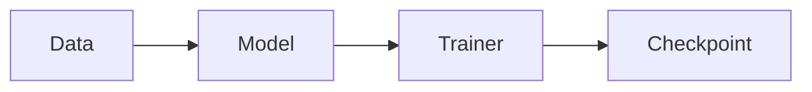

# Standard 06: Documentation

> **Audience**: Anyone writing or editing markdown docs in `docs/`.
> **Status**: Active.

---

## 1. Principles

1. **One concept per file.** Don't cram multiple decisions into one doc.
2. **Always link.** Cross-references are more valuable than duplication.
3. **Status block on every doc.** Helps readers gauge trust.
4. **Diátaxis discipline.** Each doc answers ONE type of question.

## 2. The 6 sections (recap of [docs/README.md](../README.md))

| Section | Purpose | Question answered |
|---|---|---|
| `architecture/` | Design docs | "Why is it this way?" |
| `decisions/` | ADRs | "What did we decide?" |
| `standards/` | Conventions | "How should I write?" |
| `guides/` | How-to recipes | "How do I do X?" |
| `dev-logs/` | Weekly logs | "What happened recently?" |
| `research/` | Scientific context | "What is the science?" |

**Don't mix them.** If you're tempted to put a how-to in an ADR, create a guide and link it.

## 3. Status block

Every doc starts with this YAML-like block:

```markdown
# <Title>

> **Status**: [Draft | Living | Deprecated | Superseded by <link>]
> **Audience**: [e.g., contributors, operators, researchers]
> **Last updated**: YYYY-MM-DD

---
```

Status meanings:

- **Draft**: Under construction, may have gaps
- **Living**: Active, regularly updated
- **Deprecated**: Don't read for current behavior, but kept for history
- **Superseded**: Replaced by another doc; only link to the new one

## 4. Front matter for ADRs

ADRs have a more structured front matter (see [decisions/README.md](../decisions/README.md)):

```markdown
# ADR-NNNN: <Title>

- **Status**: Accepted
- **Date**: YYYY-MM-DD
- **Deciders**: <names>
```

## 5. File naming

- **Lowercase, kebab-case**: `01-overview.md`, `why-hydra.md`
- **Numbered prefixes** for ordering inside a section: `01-overview.md`, `02-data-pipeline.md`
- **ADR numbering**: zero-padded 4 digits: `0001-...`, `0042-...`

## 6. Markdown style

### 6.1 Headings

- **One H1** per file (the title)
- **H2** for top-level sections
- **H3** for subsections
- **No skipping** levels (don't go H2 → H4)

### 6.2 Lists

- Use `-` for unordered, `1.` for ordered
- One space after the marker
- Blank line before and after lists (when not nested)

### 6.3 Code

- **Inline** code in backticks: `recon.cli.train`
- **Code blocks** with language tag for syntax highlighting:

  ````markdown
  ```python
  def foo():
      return 1
  ```

  ```bash
  bash scripts/launch_multi_node.sh baseline
  ```
  ````

### 6.4 Links

- **Relative paths** for internal links: `[Overview](../architecture/01-overview.md)`
- **Full URLs** for external: `[Hydra docs](https://hydra.cc/)`
- **Descriptive link text**: `[launch script guide](../guides/05-launch-multi-node.md)` not `[click here](../guides/05-launch-multi-node.md)`

### 6.5 Tables

Use standard markdown tables. Align with `|` for readability in source.

```markdown
| Column A | Column B |
|---|---|
| foo | bar |
```

### 6.6 Admonitions (warnings, notes)

Use blockquotes with bold label:

```markdown
> ⚠️ **Warning**: This will overwrite existing data.

> 💡 **Tip**: Run `make lint` before committing.

> 📝 **Note**: This is different from `train.py` because...
```

## 7. Diagrams

ASCII art is fine for simple diagrams. Mermaid for complex ones (GitHub renders Mermaid natively):

````markdown

````

## 8. Linking to code

When linking to a specific line:

```markdown
See [`recon/engine/trainer.py:42`](../recon/engine/trainer.py) for the loss computation.
```

When linking to a function or class:

```markdown
The [`Trainer`](../recon/engine/trainer.py) class encapsulates the training loop.
```

## 9. Maintenance

When you change code that is referenced in a doc:

- **Update the doc** in the same PR
- **Update "Last updated" date** at the top
- **Add an entry to CHANGELOG.md** if user-visible

When you make a doc that supersedes another:

- Mark the old doc with `**Status**: Superseded by <new-doc>`
- Add a link from old to new

## 10. Don't write

These are forbidden in `docs/`:

- ❌ Implementation details that belong in code docstrings (link to the code instead)
- ❌ Marketing / pitch language
- ❌ Emojis except in admonitions (see §6.6)
- ❌ "TODO" without an owner — either do it or create an issue
- ❌ Speculation about future features ("we might...")

## 11. Style guide (Markdown linter)

We use `markdownlint` (via `pre-commit`) with these rules enabled:

- `MD013`: line-length (off, hard to enforce in tables)
- `MD024`: no duplicate headings (siblings only)
- `MD033`: no inline HTML
- `MD041`: first line must be H1
- `MD046`: code-block style (fenced)

See `.markdownlint.json` for the full config.

## 12. See also

- [docs/README.md](../README.md)
- [Standard 02: Docstring style](02-docstring.md) (similar principles for Python docstrings)

---

Maintained by owner. Update when doc conventions evolve.